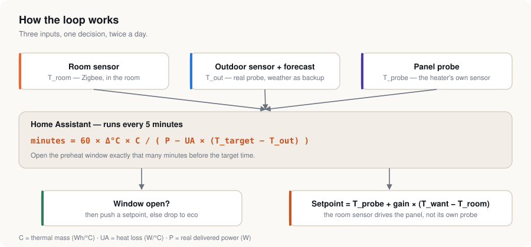
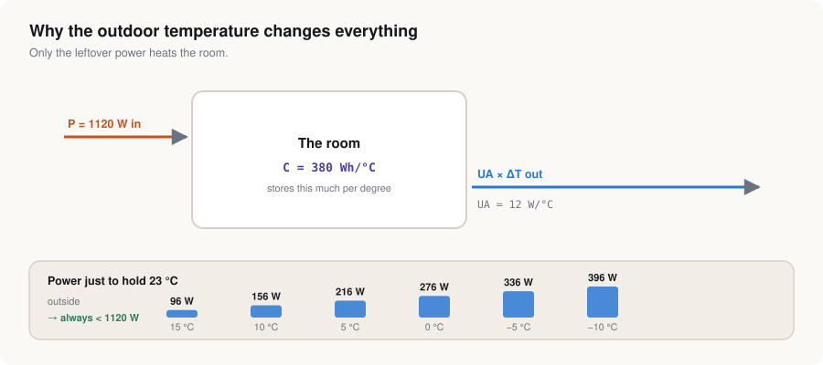
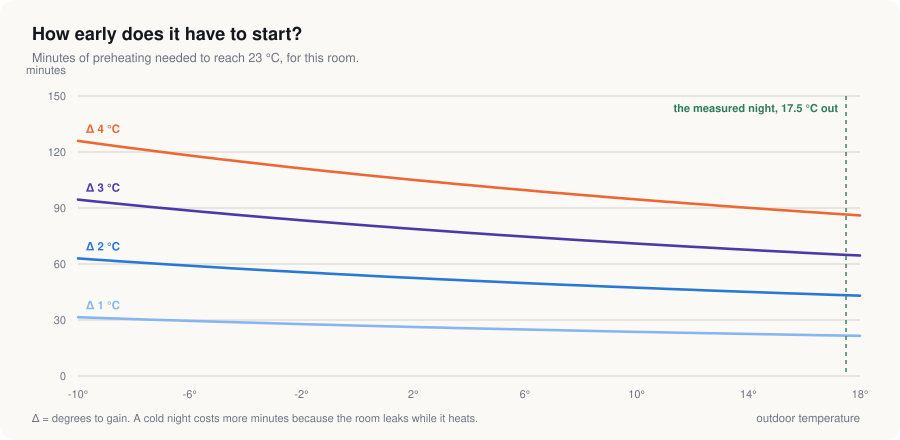
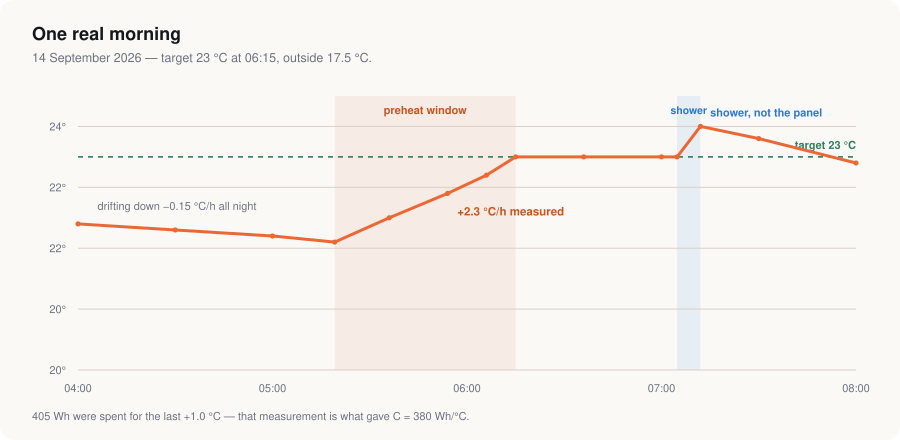

# ha-smart-preheat

**Physics-based predictive preheating for a single room in Home Assistant.**
Your heater starts at the right minute, not at a fixed hour — and it runs at the
power the room actually needs, not flat out.

<p align="center">
  
</p>

---

## Why

Our house runs on oil. When the Iran conflict pushed crude up, the winter ahead
stopped looking like a line in a budget and started looking like something we
were going to *feel*. So we began peeling rooms off the boiler one at a time,
starting with the bathroom, and putting an electric panel in instead.

An electric panel only beats oil if it is **honest about its schedule**. Heating
a bathroom from 05:00 "just in case" costs more than the oil it replaces.
Heating it from 05:48 because that is genuinely what tonight's weather requires
costs very little. That is the whole idea.

This repository is the automation that does it, and the measurements that prove
the numbers.

---

## The three ideas

**1. The room sensor decides, not the heater's own probe.**
Every connected heater has a temperature sensor *inside the appliance*. It reads
warm, it reads the heater, and it never reads where you stand. Instead of
fighting it, we offset it: we push a setpoint of `probe + gain × (wanted − room)`.
The panel keeps thermostating on its own probe, but the number it aims for is
driven by the sensor in the middle of the room.

**2. Start time is computed, not configured.**
The room is a bucket with a hole in it. Filling it takes

```
minutes = 60 × Δ°C × C / ( P − UA × (T_target − T_out) )
```

- `Δ°C` — degrees still to gain
- `C` — the room's thermal mass, in **Wh per °C**
- `UA` — how fast it leaks, in **W per °C** of indoor/outdoor difference
- `P` — the power the panel *really* delivers
- `T_out` — the outdoor probe, with the weather forecast only as a fallback

A mild night: 25 minutes. A −8 °C night: over an hour. The automation works it
out every five minutes and opens the window when it should.

**3. Modulate, don't blast.**
Because the setpoint is proportional to how far the room still is from target,
the panel throttles itself as it closes in. Long and gentle beats short and
brutal — same degrees, fewer watts, no overshoot to pay for.

<p align="center">
  
</p>

---

## Does the maths hold up?

The denominator is the part people get wrong. At 15 °C outside, a 1120 W panel
holding 23 °C has ~1024 W left over for heating. At −10 °C it has ~724 W. Same
panel, same room, **40 % longer** to get there.

<p align="center">
  
</p>

And one real morning, unedited — including the part where somebody took a hot
shower next to the sensor and the curve jumped for reasons that had nothing to
do with the heater:

<p align="center">
  
</p>

---

## What you need

| | What | Why | Example |
|---|---|---|---|
| **Required** | A connected heater exposed as a `climate` entity | something to control | Mill Invisible Gen 4, any Zigbee/WiFi TRV, any smart radiator |
| **Required** | An indoor temperature sensor **in the room** | the heater's own probe is not the room | Sonoff SNZB-02D, Aqara, anything Zigbee |
| **Required** | An outdoor temperature sensor | the denominator of the formula | any Zigbee outdoor probe, in the shade |
| **Required** | Home Assistant ≥ 2024.6 with `packages:` enabled | this ships as a package | |
| Strongly advised | A metering plug or an energy meter on the heater | the only way to calibrate `C` and `P` honestly | Zigbee plug with power reporting |
| Optional | A humidity sensor in the room | lets the loop ignore shower steam | most Zigbee temp sensors have one |
| Optional | A weather integration | fallback when the outdoor probe drops off | `weather.home` from any provider |

> **On the outdoor sensor:** use a real probe, not the forecast. On the night we
> measured, the forecast announced 11 °C for our town; the probe on the terrace
> read 17.5 °C. Six and a half degrees of error becomes a badly sized preheat.
> Keep the forecast — it is excellent for *warning you tomorrow will be hard* —
> but do not steer on it.

---

## Install

1. Enable packages in `configuration.yaml`:

   ```yaml
   homeassistant:
     packages: !include_dir_named packages
   ```

2. Copy [`packages/smart_preheat.yaml`](packages/smart_preheat.yaml) into
   `/config/packages/`.

3. Search & replace the five entity ids at the top of the file with yours:

   | Placeholder | Yours |
   |---|---|
   | `sensor.room_temperature` | the sensor in the room |
   | `sensor.room_humidity` | optional; delete the shower guard if you have none |
   | `sensor.outdoor_temperature` | your outdoor probe |
   | `weather.home` | your weather entity |
   | `climate.room_heater` | the heater |

4. Restart Home Assistant. Set your times (`input_datetime.preheat_*`) and your
   comfort/eco temperatures. Turn `input_boolean.preheat_enable` on.

5. Calibrate. This is the step that makes it work — twenty minutes of your
   attention, once.

---

## Calibration — the three numbers

All three are measured, none are guessed. Do this on a normal evening.

### P — what the panel really delivers

Read your metering plug, or better, your utility meter, with the heater on and
then off, and subtract. A "1300 W" panel is rated at 230 V. Ours sits on a phase
that runs at 220 V, and power goes as **V²**: `1300 × (220/230)² = 1190 W`. We
measured **1120 W**. Put the measured number in `input_number.preheat_power`,
not the sticker.

### C — the thermal mass, in Wh/°C

Let the heater run and watch the energy counter. Note the kWh and the room
temperature, wait for the room to rise a clean degree, note both again.

```
C = Wh consumed / °C gained
```

Ours: **405 Wh for +1.0 °C → C ≈ 380 Wh/°C** (after subtracting the leak).
A small tiled bathroom will land around 300–450; a big living room 1000+.

### UA — the leak, in W/°C

Easiest overnight, with the heating off. Note the room and outdoor temperature
in the evening and again in the morning:

```
UA = C × (°C lost) / (hours × average indoor−outdoor difference)
```

Ours: **−0.146 °C/h at a 4.6 °C difference → UA ≈ 12 W/°C**.

> **Caveat, stated honestly:** we measured UA on a mild night with only 4.6 °C of
> difference. In January, with a real gradient and a closed door, it will be
> different. Re-measure once winter arrives — it is the number that decides
> whether your panel is big enough.

### Sanity check

`UA × (comfort − coldest expected outdoor)` is the power you need just to *hold*
temperature. For us at −10 °C: `12 × 33 = 396 W`, comfortably under 1120 W.
If that number approaches your panel's power, the panel is undersized for the
room and no automation will fix it.

---

## What it gives you

| Entity | What it is |
|---|---|
| `sensor.preheat_minutes_needed` | how long the room needs, right now, given tonight's weather |
| `sensor.preheat_holding_power` | watts required just to hold comfort |
| `sensor.preheat_wanted_temperature` | comfort / eco / holiday, resolved |
| `binary_sensor.preheat_window` | is the preheat window open — with `morning_starts_at` as an attribute |
| `script.preheat_apply` | the only thing that ever writes to the heater |

`binary_sensor.preheat_window`'s attributes are the nice thing to put on a
dashboard: *"heating will start at 05:48."*

---

## Results

Bathroom, 14 September 2026. Target 23 °C at 06:15, 17.5 °C outside.

| | |
|---|---|
| Computed preheat | 32 minutes |
| Measured rise | **+2.3 °C/h** (2.8 °C/h modelled at full power) |
| Energy for the last degree | 405 Wh |
| Target reached | on time |
| Power to hold 23 °C at 0 °C outside | 276 W |
| … at −10 °C outside | 396 W |

The panel it replaced was a 2000 W oil radiator on the boiler loop — a catalogue
figure quoted at a 50 K water-to-air difference. At the ~60 °C flow temperature
the boiler actually ran, it delivered roughly 1200 W. The 1120 W electric panel
is not the downgrade the numbers on the box suggest.

---

## Gotchas we paid for

- **Never use `initial:` on an `input_number`.** It resets your calibration at
  every restart. The package ships a startup automation that only fills helpers
  still parked at their minimum.
- **Don't let the window close mid-ramp.** As the room approaches target,
  `Δ°C` shrinks and the computed window shrinks with it — it can close while you
  are still two tenths short. The floor `max(comfort − room, 0.5)` in the
  formula is there for exactly that, and it cost us one cold morning to find.
- **A hot shower is not a warm room.** Our sensor is 1.5 m from the shower head
  and gains two degrees in three minutes when it runs. The loop ignores the room
  sensor above a humidity threshold instead of cutting the heating at the worst
  possible moment.
- **Cheap metering plugs report garbage spikes.** Feed the raw power sensor
  through a `filter` platform sensor (range + outlier + moving average) before
  you trust it for calibration.
- **Check your phase voltage** before blaming the heater. An unbalanced
  three-phase supply cost us 10 V, and power goes as V².

---

## Adapting it to more rooms

The package is written for one room on purpose — it is meant to be read and
understood before it is copied. For a second room, duplicate the file, replace
`preheat_` with `preheat_kitchen_` throughout, and point the five entity ids at
that room's hardware. Each room gets its own `C`, its own `UA` and its own
schedule, which is the point: they are genuinely different rooms.

---

## Regenerating the figures

```bash
python3 tools/make_figures.py
```

No dependencies. The room constants at the top of the script are the ones used
in the charts — change them to yours and the simulation becomes yours.

---

## License

MIT. See [LICENSE](LICENSE). Built at home, in Belgium, because oil got
expensive. If you improve it, a pull request is very welcome.
